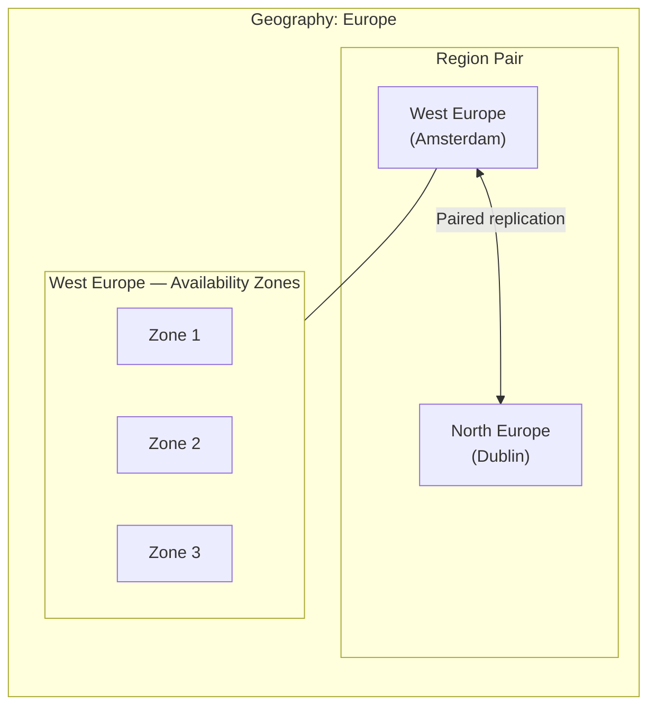

# 🏗️ High Availability Design
{: .no_toc }

**Eliminating single points of failure — regions, zones, redundancy patterns, and SLA composition**
{: .fs-5 .fw-300 }

---

## Table of Contents
{: .no_toc .text-delta }

1. TOC
{:toc}

---

## HA vs DR
{: #ha-vs-dr }

These two concepts are the **most commonly confused** in AZ-305 scenarios. They are complementary but fundamentally different in scope, cost, and tooling:

| Dimension | High Availability (HA) | Disaster Recovery (DR) |
|-----------|----------------------|----------------------|
| **Goal** | Prevent downtime during failures | Restore service after a catastrophic failure |
| **Scope** | Hardware faults, zone outages, rolling failures | Full regional outage, data corruption, ransomware |
| **Mechanism** | Redundancy, load balancing, auto-failover | Replication, backup restore, manual/automated failover |
| **RTO target** | Seconds to minutes (often zero) | Minutes to hours |
| **RPO target** | Near-zero (synchronous replication) | Minutes to hours (async replication or backup) |
| **Cost** | Higher baseline (always running replicas) | Lower baseline (standby / backup storage) |
| **Azure services** | AZs, Load Balancer, Traffic Manager, Front Door, Always On AG | Azure Site Recovery, Azure Backup, Geo-replication |

> ⚠️ **Exam Caveat — HA ≠ DR:** If the scenario says "survive a complete regional outage" or "recover from accidental deletion", HA alone is insufficient — **DR services (ASR, Backup)** are required. If the scenario says "survive a single VM or zone failure with zero downtime", the answer is HA (Availability Zones, Load Balancer) — not ASR.

---

## Azure Regions and Region Pairs

Azure organises its infrastructure into **regions** (physical locations with one or more datacentres) and **region pairs** (two paired regions within the same geography for DR purposes).



### Region Pair Properties

| Property | Detail |
|----------|--------|
| **Sequential updates** | Azure updates paired regions sequentially — one region at a time |
| **Prioritised recovery** | During a broad outage, one region per pair is prioritised for recovery |
| **Data residency** | Region pairs stay within the same geopolitical boundary (except Brazil South) |
| **Minimum distance** | At least 300 miles apart (protects against regional disasters) |
| **GRS replication target** | Geo-Redundant Storage always replicates to the paired region |

> ⚠️ **Exam Caveat — GRS Paired Region:** Azure Geo-Redundant Storage (GRS) replicates data **asynchronously** to the **paired region** — you cannot choose the secondary region. If you need to choose your secondary, use object replication or manually replicate to any region.

---

## Availability Zones

Availability Zones (AZs) are **physically separate datacentres** within a single region, each with independent power, cooling, and networking. They are the foundation of intra-region HA.

### Zonal vs Zone-Redundant Services

| Pattern | Description | Example Services |
|---------|-------------|-----------------|
| **Zonal** | Resource pinned to a specific zone | VM in Zone 1, Managed Disk in Zone 1 |
| **Zone-redundant** | Resource automatically spans all zones | Zone-Redundant Storage, Standard Load Balancer, Azure SQL Business Critical |
| **Zone-resilient** | Survives zone failures by design (no config needed) | Azure Service Bus Premium, Azure App Service Environment v3 |

> ⚠️ **Exam Caveat — Not All Regions Have AZs:** Availability Zones are not available in all Azure regions. If the scenario specifies a region without AZs, the only intra-region HA option is an **Availability Set** (99.95% SLA). Always check region AZ availability in architecture questions.

---

## SLA Composition
{: #sla-composition }

When multiple components form a chain, the **composite SLA is the product of individual SLAs** — and it is always lower than the weakest individual SLA.

### Series (all components must be up)

```
Composite SLA = SLA₁ × SLA₂ × SLA₃ …

Example: Web App (99.95%) × SQL Database (99.99%) × Storage (99.9%)
         = 0.9995 × 0.9999 × 0.999 = 99.84%
```

### Parallel (redundant — any one component keeps the service up)

```
Composite SLA = 1 − ((1 − SLA₁) × (1 − SLA₂))

Example: Two VMs in Availability Zones (each 99.9%)
         = 1 − ((1 − 0.999) × (1 − 0.999))
         = 1 − (0.001 × 0.001) = 99.9999%
```

> ⚠️ **Exam Caveat — SLA Maths:** The exam may present an N-tier architecture and ask whether a given composite SLA is achievable. Always multiply SLAs for series components. Adding redundancy in parallel **dramatically increases** the composite SLA — two 99.9% VMs in parallel achieve ~99.9999%.

---

## Load Balancing & Global Routing

Azure offers four main load-balancing services, each operating at a different layer and scope:

| Service | Layer | Scope | Protocol | Use Case |
|---------|-------|-------|----------|----------|
| **Azure Load Balancer** | L4 (TCP/UDP) | Regional | TCP / UDP | Internal and public VM load balancing, zone-redundant |
| **Application Gateway** | L7 (HTTP/S) | Regional | HTTP / HTTPS / WebSocket | Web apps, URL-based routing, WAF, SSL offload |
| **Azure Front Door** | L7 (HTTP/S) | Global | HTTP / HTTPS | Global web acceleration, WAF, failover, CDN |
| **Traffic Manager** | DNS | Global | Any (DNS-based) | Non-HTTP global routing, multi-region failover |

### Traffic Manager Routing Methods

| Method | Description | Use Case |
|--------|-------------|----------|
| **Priority** | Route to primary; failover to secondary | Active/passive DR |
| **Weighted** | Distribute traffic by weight % | A/B testing, gradual migration |
| **Performance** | Route to lowest-latency endpoint | Global users, multi-region active/active |
| **Geographic** | Route by user's geographic location | Data sovereignty, regional content |
| **Multivalue** | Return multiple healthy endpoints | DNS clients that can try multiple IPs |
| **Subnet** | Route by client IP subnet | User-segment-based routing |

> ⚠️ **Exam Caveat — Traffic Manager vs Front Door:**
> - **Traffic Manager** is DNS-based — it directs the client to an endpoint, but all subsequent traffic goes directly to that endpoint (no proxy). Suitable for non-HTTP traffic, TCP applications.
> - **Front Door** is a reverse proxy — it terminates the connection and proxies traffic. Supports WAF, DDoS, caching, SSL offload. Suitable for HTTP/HTTPS web workloads.
> - If the scenario mentions "global routing for a web application with WAF", the answer is **Front Door**. If it says "global routing for a non-HTTP application", the answer is **Traffic Manager**.

---

## HA Patterns by Service

### Virtual Machines

| Configuration | SLA | Notes |
|--------------|-----|-------|
| Single VM + Premium SSD | 99.9% | Minimal — no redundancy |
| Availability Set (2+ VMs) | 99.95% | Rack-level fault isolation |
| Availability Zones (2+ VMs) | 99.99% | Datacenter-level fault isolation |
| VMSS + AZs | 99.99% | Auto-scale + zone redundancy |

### Azure SQL Database

| Configuration | SLA | Notes |
|--------------|-----|-------|
| General Purpose (single) | 99.99% | Remote storage HA pair |
| Business Critical (single) | 99.99% | Local SSD Always On AG, readable secondary |
| Any tier + Auto-Failover Group | 99.99% | Cross-region active/passive |

### App Service

| Configuration | SLA |
|--------------|-----|
| Basic through Premium (single region) | 99.95% |
| App Service Environment v3 | 99.99% |
| Multi-region + Traffic Manager | Composite (higher) |

---

## Common Exam Scenarios

| Scenario | Answer |
|----------|--------|
| Survive a complete Azure regional outage | **DR strategy** — ASR or Backup + cross-region (not just AZs) |
| Survive zone failure with zero downtime | **Availability Zones** + zone-redundant services |
| Global HTTP routing with WAF and CDN | **Azure Front Door** |
| Global failover for a non-HTTP TCP app | **Traffic Manager** (Priority routing) |
| SLA maths: are two 99.9% VMs in AZs enough for 99.99% target? | Yes — parallel SLA = 1−(0.001²) = 99.9999% |
| Route EU users to EU region, US users to US | **Traffic Manager** (Geographic routing) |
| Gradually migrate 10% of traffic to new region | **Traffic Manager** (Weighted routing) |
| N-tier app composite SLA below target | Add **redundancy** (parallel components) or upgrade tiers |

---

[← Back to Home](/az-305-bcdr/) | [02 — Azure Backup →](/az-305-bcdr/02-azure-backup/)