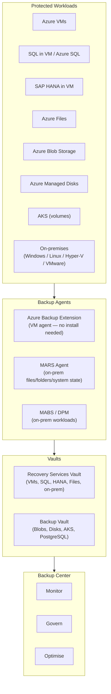

# 💾 Azure Backup
{: .no_toc }

**Centralised backup for Azure and on-premises workloads — vaults, agents, policies, and data protection**
{: .fs-5 .fw-300 }

---

## Table of Contents
{: .no_toc .text-delta }

1. TOC
{:toc}

---

## Product Overview

Azure Backup is a **cloud-native backup service** that protects Azure VMs, SQL databases, SAP HANA, Azure Files, Blobs, Disks, AKS workloads, and on-premises machines — all managed from a centralised **Backup Center**. It replaces traditional on-premises backup infrastructure and stores data in **Recovery Services Vaults** or **Backup Vaults** with configurable replication and retention policies.

---

## Vault Types
{: #vault-types }

This is one of the **most exam-tested distinctions** in the Backup domain:

| Feature | Recovery Services Vault | Backup Vault |
|---------|------------------------|--------------|
| **Azure VMs** | ✅ | ❌ |
| **SQL Server in VM** | ✅ | ❌ |
| **SAP HANA in VM** | ✅ | ❌ |
| **Azure Files** | ✅ | ❌ |
| **On-premises (MARS/MABS)** | ✅ | ❌ |
| **Azure Blob Storage** | ❌ | ✅ |
| **Azure Managed Disks** | ❌ | ✅ |
| **AKS workloads** | ❌ | ✅ |
| **Azure Database for PostgreSQL** | ❌ | ✅ |
| **Cross-region restore** | ✅ (GRS vaults) | ✅ (select workloads) |
| **Soft delete** | ✅ | ✅ |
| **Immutable vault** | ✅ | ✅ |

> ⚠️ **Exam Caveat — Vault Selection:** Azure Blob and Managed Disk backups use **Backup Vault** — not Recovery Services Vault. Azure VM and SQL Server backups use **Recovery Services Vault**. Choosing the wrong vault type is a frequent exam trap.

---

## Backup Agents

| Agent | Protects | Installed On | Vault |
|-------|----------|-------------|-------|
| **Azure VM Extension** | Full VM (OS + data disks) | Auto-installed on Azure VM | Recovery Services Vault |
| **MARS (Microsoft Azure Recovery Services)** | Files, folders, system state | On-premises Windows machine or Azure VM | Recovery Services Vault |
| **MABS (Microsoft Azure Backup Server)** | VMs (Hyper-V, VMware), SQL, SharePoint, Exchange | On-premises Windows Server | Recovery Services Vault |
| **DPM (Data Protection Manager)** | Same as MABS + tape | On-premises Windows Server | Recovery Services Vault |

> ⚠️ **Exam Caveat — MARS vs MABS:** MARS protects **files and folders** on individual machines. MABS protects **entire workloads** (VMs, SQL, Exchange) and acts as a secondary backup server. If the scenario mentions protecting a VMware environment on-premises, the answer is **MABS** (not MARS).

---

## Storage Replication Options

Configured at vault level — determines where backup data is stored:

| Redundancy | Description | Use Case | SLA |
|------------|-------------|----------|-----|
| **LRS** (Locally Redundant Storage) | 3 copies in same datacenter | Dev/test, non-critical | Lowest cost |
| **ZRS** (Zone-Redundant Storage) | 3 copies across AZs in same region | Intra-region resilience | Medium cost |
| **GRS** (Geo-Redundant Storage) | LRS + async copy to paired region | Regional disaster protection | Standard |
| **RA-GRS** (Read-Access GRS) | GRS + readable secondary | Cross-region read during outage | Higher cost |

> ⚠️ **Exam Caveat — Vault Redundancy Must Be Set Before First Backup:** The vault storage redundancy setting **cannot be changed** after the first backup item is registered. Plan redundancy before configuring backups. If cross-region restore is required, the vault must be set to **GRS**.

---

## Backup Policies

A backup policy defines **frequency** (how often to back up) and **retention** (how long to keep each recovery point).

| Backup Tier | Frequency Options | Max Retention |
|------------|------------------|---------------|
| **Operational (Azure Blob)** | Continuous (point-in-time) | 360 days |
| **Snapshot (VM)** | Daily / multiple per day | 5 days (snapshots only) |
| **Daily vault** | Once per day | **9,999 days (~27 years)** |
| **Weekly vault** | Once per week | 5,163 weeks |
| **Monthly vault** | Once per month | 1,188 months |
| **Yearly vault** | Once per year | 99 years |

---

## Soft Delete

Soft delete protects backup data from **accidental or malicious deletion**. When a backup item is deleted, the data is retained for an additional period before permanent removal.

| Feature | Detail |
|---------|--------|
| **Default retention** | **14 days** after deletion |
| **Enhanced soft delete** | Configurable up to **180 days** |
| **Always-on** | Can be made irreversible — cannot be disabled once locked |
| **Cost** | Soft-deleted data is charged at standard backup storage rates |
| **Re-protect** | Soft-deleted items can be undeleted and re-protected |
| **Scope** | Per vault |

> ⚠️ **Exam Caveat — Soft Delete Default is 14 Days:** The default soft delete period is **14 days**, not the enhanced maximum. If the scenario requires longer accidental deletion protection, **Enhanced Soft Delete** must be explicitly configured. If the question asks for an irreversible protection, enable **Always-On Soft Delete**.

---

## Immutable Vault

An immutable vault enforces a **Write-Once Read-Many (WORM)** policy — backup data cannot be modified or deleted before the configured retention period expires, even by administrators.

| Feature | Detail |
|---------|--------|
| **Purpose** | Ransomware protection, compliance (WORM) |
| **Locking** | Unlocked (can be disabled) or **Locked** (irreversible, cannot be disabled) |
| **Scope** | Per vault |
| **Interaction with soft delete** | Complementary — immutability prevents deletion, soft delete provides a recovery window |

> ⚠️ **Exam Caveat — Locked Immutable Vault is Irreversible:** Once a vault is locked as immutable, it **cannot be unlocked**. This is intentional for compliance scenarios (SEC Rule 17a-4, FINRA). If the scenario mentions regulatory WORM compliance for backups, the answer is **Locked Immutable Vault**.

---

## Cross-Region Restore

Cross-Region Restore (CRR) allows restoring backed-up data to the **paired region** — used to recover from a primary region outage or to test DR procedures.

| Property | Detail |
|----------|--------|
| **Vault requirement** | GRS-enabled Recovery Services Vault |
| **Supported workloads** | Azure VMs, SQL Server in VM, SAP HANA in VM |
| **Data lag** | Secondary region data is typically **48 hours** behind primary |
| **Cost** | Additional charge for cross-region restore operation |
| **Trigger** | Manual (not automatic failover) |

> ⚠️ **Exam Caveat — CRR is Manual:** Cross-Region Restore does **not** automatically restore workloads during a regional outage — it must be manually triggered. For automated regional failover of running workloads, use **Azure Site Recovery** instead of Backup.

---

## Backup Center

Backup Center is a **unified management interface** for all Azure Backup operations across subscriptions, regions, and vault types:

| Capability | Detail |
|------------|--------|
| **Monitor** | All backup jobs, alerts, and health across vaults |
| **Govern** | Azure Policy integration — enforce backup policies at scale |
| **Optimise** | Identify unprotected workloads, cost recommendations |
| **Multi-subscription** | Single pane of glass across subscriptions and management groups |

---

## RBAC Roles for Backup

| Role | Permissions |
|------|-------------|
| **Backup Contributor** | Create and manage backups, cannot delete vault |
| **Backup Operator** | Manage backup jobs (disable, stop, trigger), cannot create policies |
| **Backup Reader** | View backup status and jobs — read-only |
| **Backup Restore Operator** | Trigger restore operations |

---

## Common Exam Scenarios

| Scenario | Answer |
|----------|--------|
| Back up Azure Blobs with point-in-time restore | **Backup Vault** (not Recovery Services Vault) |
| Back up Azure VMs + SQL in VM from one vault | **Recovery Services Vault** |
| Protect on-premises files/folders to Azure | **MARS Agent** → Recovery Services Vault |
| Protect on-premises VMware VMs to Azure | **MABS** → Recovery Services Vault |
| Prevent backup admin from deleting backup data | **Locked Immutable Vault** |
| Recover backup after accidental deletion, within 14 days | **Soft Delete** (default) |
| WORM compliance for backup (SEC 17a-4) | **Locked Immutable Vault** |
| Restore VM to paired region after regional outage | **Cross-Region Restore** (GRS vault, manual) |
| Enforce mandatory backup policy across all subscriptions | **Backup Center** + Azure Policy |
| Change vault redundancy after first backup registered | ❌ Not possible — plan before first backup |

---

[← 01 - High Availability Design](/az-305-bcdr/01-high-availability/) | [03 — Azure Site Recovery →](/az-305-bcdr/03-azure-site-recovery/)