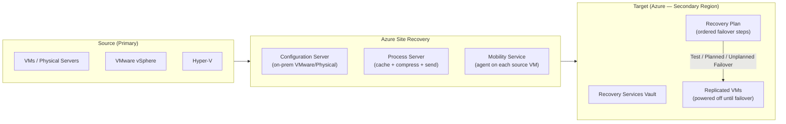

# 🔄 Azure Site Recovery
{: .no_toc }

**Disaster recovery as a service — replicate, failover, and failback Azure and on-premises workloads**
{: .fs-5 .fw-300 }

---

## Table of Contents
{: .no_toc .text-delta }

1. TOC
{:toc}

---

## Product Overview

Azure Site Recovery (ASR) is a **Disaster Recovery as a Service (DRaaS)** solution that continuously replicates workloads from a source location to a target location. In the event of an outage, you can **fail over** to the target and keep applications running, then **fail back** when the source is restored.

ASR is the correct answer when the scenario requires **running workloads to continue in a secondary location during a regional outage** — whereas Azure Backup is for point-in-time recovery of data.

---

## Supported Scenarios
{: #supported-scenarios }

| Scenario | Source | Target | Notes |
|----------|--------|--------|-------|
| **Azure to Azure** | Azure VMs (any region) | Different Azure region | Most common — intra-cloud DR |
| **VMware to Azure** | On-prem VMware vSphere | Azure | Requires Configuration Server + Mobility Service |
| **Physical to Azure** | On-prem Windows/Linux servers | Azure | Same agent stack as VMware |
| **Hyper-V to Azure** | On-prem Hyper-V (with VMM or standalone) | Azure | Uses Azure Site Recovery Provider + agent |
| **Hyper-V to Hyper-V** | On-prem Hyper-V | Secondary on-prem site | Requires VMM |

> ⚠️ **Exam Caveat — Azure-to-Azure ASR:** For Azure VMs, the Mobility Service is automatically installed — no manual agent configuration needed. The vault must be in a **third region** (not source or target) to avoid the vault itself being affected by a regional outage. However, most exam questions accept that the vault is in the target region for simplicity.

---

## Key Components

### Azure-to-Azure (no on-premises infrastructure needed)

| Component | Role |
|-----------|------|
| **Recovery Services Vault** | Stores replication metadata and recovery points |
| **Mobility Service** | Auto-installed extension on source Azure VMs; captures disk writes |
| **Cache Storage Account** | Temporary staging in the source region before transfer to target |
| **Replica Managed Disks** | Target disks kept in sync — powered off until failover |

### VMware/Physical to Azure (on-premises components required)

| Component | Role |
|-----------|------|
| **Configuration Server** | On-prem Windows Server 2016 VM; orchestrates replication; hosts Process Server by default |
| **Process Server** | Receives data from Mobility Service, caches, compresses, encrypts, sends to Azure |
| **Mobility Service** | Agent installed on every source VM/physical server being replicated |
| **Master Target Server** | Used during failback — receives data from Azure to on-prem |

---

## RPO and RTO

| Workload | Typical RPO | Typical RTO |
|----------|------------|------------|
| Azure VM (Azure-to-Azure) | **Seconds** (crash-consistent) / ~60 min (app-consistent) | **Minutes** (pre-replicated disks) |
| VMware VM to Azure | ~15 seconds (crash-consistent) | Minutes to ~2 hours |
| Hyper-V to Azure | ~30 seconds | Minutes to ~2 hours |

### Recovery Point Types

| Type | Description | Frequency |
|------|-------------|-----------|
| **Crash-consistent** | Captures disk state at a point in time — like pulling the power cord | Every 5 minutes (default) |
| **App-consistent** | Uses VSS/pre/post scripts to quiesce the application before snapshot | Configurable (every 1–12 hours) |

> ⚠️ **Exam Caveat — App-Consistent vs Crash-Consistent:** For databases (SQL Server, Oracle), **app-consistent snapshots** are required to guarantee a clean recovery without transaction log replay errors. Crash-consistent snapshots may leave databases in an inconsistent state requiring manual recovery.

---

## Recovery Plans

A **Recovery Plan** defines the **order and actions** for failing over a multi-tier application:

| Feature | Detail |
|---------|--------|
| **Groups** | Machines organised into groups; groups fail over sequentially |
| **Boot order** | Group 1 boots first (e.g., domain controllers), Group 2 next (e.g., app servers), Group 3 last (e.g., web front-ends) |
| **Azure Automation runbooks** | Custom scripts injected between groups — e.g., update DNS, reconfigure load balancer |
| **Manual actions** | Pause the plan for human intervention steps |
| **Max machines per plan** | 100 VMs |

> ⚠️ **Exam Caveat — Recovery Plans for Multi-Tier Apps:** If the scenario involves a multi-tier application (domain controller → app server → web tier) that must fail over in a specific sequence, the answer is a **Recovery Plan** with ordered groups and optional runbook automation — not individual VM failovers.

---

## Failover Types

| Failover Type | Description | Disruption | Use Case |
|--------------|-------------|------------|---------|
| **Test Failover** | Spins up replicated VMs in an **isolated network** — source keeps running | ❌ None | DR drills, compliance testing |
| **Planned Failover** | Graceful failover — source VMs are shut down first to achieve **zero data loss** | Source stops | Planned maintenance migrations |
| **Unplanned (Emergency) Failover** | Immediate failover — source may still be running | Potential data loss | Real disaster — region outage |

> ⚠️ **Exam Caveat — Test Failover Does Not Affect Production:** Test failovers use an **isolated Azure VNet** — production VMs keep replicating and running. Always use Test Failover for DR drills to avoid accidentally taking over from a healthy source. The exam may ask which failover type is appropriate for "testing DR without impacting users" — the answer is always **Test Failover**.

---

## Replication Policy

| Setting | Default | Notes |
|---------|---------|-------|
| **RPO threshold** | 60 minutes | Alert triggers if RPO exceeds this |
| **Recovery point retention** | 24 hours | How long recovery points are kept |
| **App-consistent snapshot frequency** | 4 hours | Frequency of application-quiesced snapshots |
| **Multi-VM consistency** | Off by default | Enable for clustered workloads (performance impact) |

---

## Networking Considerations

| Requirement | Solution |
|-------------|----------|
| Preserve source IP addresses in target region | Configure static IP in target NIC settings |
| Place failed-over VMs in a specific VNet/subnet | Configure target network mapping in ASR |
| Custom DNS after failover | Inject DNS update via Recovery Plan runbook |
| NSGs on target VMs | Pre-create and map in replication settings |

---

## Security

| Feature | Detail |
|---------|--------|
| **Encryption in transit** | TLS 1.2 for all replication traffic |
| **Encryption at rest** | Target disks encrypted with SSE (PMK or CMK) |
| **RBAC** | Site Recovery Contributor, Site Recovery Operator, Site Recovery Reader |
| **Managed Identity** | ASR uses managed identity to access storage and compute in target region |

---

## Common Exam Scenarios

| Scenario | Answer |
|----------|--------|
| Keep Azure VMs running in secondary region during outage | **Azure Site Recovery** (Azure-to-Azure) |
| Replicate on-premises VMware VMs to Azure | **ASR** with Configuration Server + Mobility Service |
| Test DR without affecting production | **Test Failover** (isolated VNet) |
| Fail over a 3-tier app in the correct boot order | **Recovery Plan** with ordered groups |
| Execute DNS update script during failover | **Recovery Plan + Azure Automation Runbook** |
| Achieve RPO < 15 seconds for VMware workloads | **ASR** (default crash-consistent interval ~15 sec) |
| Require app-consistent recovery for SQL Server | Enable **app-consistent snapshots** in replication policy |
| Recover from accidental file deletion (not outage) | **Azure Backup** (not ASR — ASR is for outage DR) |
| Fail back VMware VMs from Azure to on-premises | **ASR Failback** via Master Target Server |

---

[← 02 - Azure Backup](/az-305-bcdr/02-azure-backup/) | [04 — Azure Migrate →](/az-305-bcdr/04-azure-migrate/) 