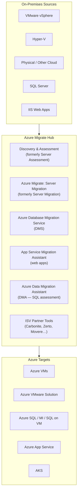
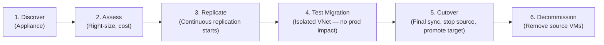

# 🔭 Azure Migrate
{: .no_toc }

**The unified migration hub — discover, assess, and migrate servers, databases, and web apps to Azure**
{: .fs-5 .fw-300 }

---

## Table of Contents
{: .no_toc .text-delta }

1. TOC
{:toc}

---

## Azure Migrate Hub
{: #azure-migrate-hub }

Azure Migrate is a **centralised migration platform** in the Azure portal that consolidates discovery, assessment, and migration tools from both Microsoft and ISV partners into a single experience. It does not perform migrations itself — it **orchestrates** and integrates the right tools for each workload type.

---

## Azure Migrate Appliance

The **Azure Migrate appliance** is a lightweight on-premises VM (VMware, Hyper-V, or physical) that performs **agentless discovery and assessment** — it does not require agents on individual source VMs.

| Property | Detail |
|----------|--------|
| **Deployment** | OVA template (VMware), VHD (Hyper-V), or installer script (physical) |
| **Discovery** | vCenter API for VMware; Hyper-V WMI; agent for physical |
| **Data collected** | VM inventory, CPU/memory/disk utilisation, network dependencies, installed apps |
| **Communication** | Appliance → Azure Migrate project (outbound HTTPS 443 only) |
| **Max inventory** | Up to 10,000 VMs per VMware appliance; 5,000 per Hyper-V |
| **Continuous assessment** | Sends performance data continuously for right-sizing |

---

## Discovery and Assessment

### Assessment Types

| Assessment | Target | Sizing Basis |
|------------|--------|-------------|
| **Azure VM assessment** | Azure VMs | As-on-premises or performance-based sizing |
| **Azure VMware Solution (AVS)** | AVS nodes | Maps VMs to AVS SKUs |
| **Azure SQL assessment** | Azure SQL DB / MI / SQL on VM | Compatibility + configuration analysis |
| **Azure App Service assessment** | Azure App Service | IIS app readiness |
| **AKS assessment** | AKS | Container readiness |

### Sizing Strategies

| Strategy | Description | Best For |
|----------|-------------|---------|
| **As on-premises** | Maps current CPU/RAM directly to Azure VM size | Predictable workloads, compliance-driven sizing |
| **Performance-based** | Analyses 30+ days of utilisation data, right-sizes to actual usage | Cost-optimised migration |

> ⚠️ **Exam Caveat — Performance-Based Sizing Requires Data Collection Period:** Performance-based assessments require the appliance to collect utilisation data for a **minimum of 1 day** (recommended: 30 days) before generating a reliable sizing recommendation. If the scenario says "migrate immediately", use **as-on-premises** sizing and right-size post-migration.

---

## Dependency Analysis

Dependency analysis maps **network connections** between VMs to identify hidden dependencies before migration — prevents breaking communication paths.

| Mode | How It Works | Agent Required |
|------|-------------|---------------|
| **Agentless** | Captures TCP connection data via the appliance (VMware only) | ❌ No agents on source VMs |
| **Agent-based** | Installs Log Analytics Agent + Dependency Agent on each VM; uses Service Map | ✅ Agents on each VM |

| Feature | Agentless | Agent-based |
|---------|-----------|-------------|
| Process-level details | ❌ | ✅ |
| Port-level details | ✅ (limited) | ✅ (full) |
| Cross-platform | VMware only | VMware, Hyper-V, Physical |
| Setup complexity | Low | Medium |

> ⚠️ **Exam Caveat:** Agentless dependency analysis is **VMware-only**. For Hyper-V or physical servers, **agent-based** dependency analysis is required.

---

## Azure Migrate: Server Migration

Migrates VMs to Azure using replication — similar mechanism to ASR but optimised for **one-time migration** rather than ongoing DR.

| Source | Method |
|--------|--------|
| **VMware (agentless)** | vCenter snapshot-based replication via appliance |
| **VMware (agent-based)** | Mobility Service installed on each VM |
| **Hyper-V** | Azure Migrate agent on Hyper-V host |
| **Physical / AWS / GCP** | Mobility Service on each machine |

### Migration Steps

> ⚠️ **Exam Caveat — Test Migration Before Cutover:** The **Test Migration** step spins up migrated VMs in an isolated VNet — without stopping source machines — allowing validation before the real cutover. This is a best-practice step the exam expects you to include in migration plans.

---

## Azure Database Migration Service (DMS)

DMS migrates **databases** to Azure with minimal downtime using online (continuous sync) or offline (one-time bulk load) modes.

| Source | Target | Mode |
|--------|--------|------|
| SQL Server (on-prem / VM) | Azure SQL Database | Online (CDC) + Offline |
| SQL Server (on-prem / VM) | Azure SQL Managed Instance | Online (CDC) + Offline |
| SQL Server (on-prem / VM) | SQL Server on Azure VM | Offline (backup/restore) |
| MySQL (on-prem) | Azure Database for MySQL | Online + Offline |
| PostgreSQL (on-prem) | Azure Database for PostgreSQL | Online + Offline |
| Oracle | Azure Database for PostgreSQL | Offline |
| MongoDB | Azure Cosmos DB (API for MongoDB) | Offline |

### DMS SKUs

| SKU | Use Case | Online Migration |
|-----|----------|-----------------|
| **Standard (shared)** | Small migrations, offline only | ❌ |
| **Premium (dedicated)** | Large databases, online (near-zero downtime) | ✅ |

> ⚠️ **Exam Caveat — DMS Premium for Online Migration:** Near-zero downtime online migration using **Change Data Capture (CDC)** requires the **Premium SKU**. The Standard SKU only supports offline (full dump and restore) migrations. If the scenario says "migrate a 2 TB SQL database with minimal downtime", the answer is **DMS Premium**.

---

## SQL Assessment Tools

| Tool | Purpose |
|------|---------|
| **Data Migration Assistant (DMA)** | Assess SQL Server compatibility, identify breaking changes, recommend target (SQL DB vs MI vs VM) |
| **Database Experimentation Assistant (DEA)** | Replay workload traces to measure performance on target |
| **SQL Server Migration Assistant (SSMA)** | Migrate non-SQL databases (Oracle, MySQL, Access, Sybase) to SQL Server or Azure SQL |

---

## Common Exam Scenarios

| Scenario | Answer |
|----------|--------|
| Discover on-premises VMware estate without agents | **Azure Migrate appliance** (agentless) |
| Right-size Azure VMs based on actual usage | **Azure Migrate assessment** — performance-based sizing |
| Map dependencies between VMs before migration | **Dependency analysis** (agentless for VMware, agent-based for Hyper-V) |
| Migrate SQL Server to Azure SQL MI with minimal downtime | **DMS Premium** (online/CDC mode) |
| Assess SQL Server compatibility before migration | **Data Migration Assistant (DMA)** |
| Validate migrated VMs before cutting over production | **Test Migration** (isolated VNet) |
| Migrate Oracle database to Azure PostgreSQL | **SSMA** (SQL Server Migration Assistant) |
| Migrate IIS web apps to Azure App Service | **App Service Migration Assistant** |
| Migrate 5,000 VMware VMs at scale | **Azure Migrate** + agentless replication |

---

[← 03 - Azure Site Recovery](/az-305-bcdr/03-azure-site-recovery/) | [05 — Azure VMware Solution →](/az-305-bcdr/05-azure-vmware-solution/) 