# 🌿 Azure VMware Solution (AVS)
{: .no_toc }

**Run VMware workloads natively on Azure — lift-and-shift without refactoring**
{: .fs-5 .fw-300 }

---

## Table of Contents
{: .no_toc .text-delta }

1. TOC
{:toc}

---

## Product Overview

Azure VMware Solution (AVS) is a **Microsoft first-party service** that provides a fully managed **VMware Software-Defined Data Centre (SDDC)** on dedicated Azure bare-metal infrastructure. AVS runs the full VMware stack — vSphere, vSAN, NSX-T, and HCX — allowing organisations to extend or migrate VMware workloads to Azure **without changing VM formats, management tools, or operational processes**.

AVS is the correct answer when the scenario involves VMware workloads that cannot be refactored or re-platformed — particularly when VMware-specific features (vSphere HA, DRS, vSAN, NSX-T microsegmentation) must be preserved.

```mermaid
flowchart LR
    subgraph OnPrem["On-Premises VMware"]
        VCENTER["vCenter Server"]
        ESXI["ESXi Hosts"]
        VSAN_OP["vSAN Datastore"]
        NSX_OP["NSX-T"]
        HCX_OP["HCX Connector\n(on-prem side)"]
    end
    subgraph AVS["Azure VMware Solution Private Cloud"]
        VCENTER_A["vCenter Server\n(Azure-managed)"]
        ESXI_A["AV-series Bare Metal Hosts"]
        VSAN_A["vSAN Datastore\n(NVMe SSDs)"]
        NSX_A["NSX-T\n(microsegmentation)"]
        HCX_A["HCX Cloud\n(Azure side)"]
    end
    subgraph Azure["Azure Native Services"]
        ANF["Azure NetApp Files\n(external datastore)"]
        MON["Azure Monitor"]
        KV["Key Vault"]
        ADB["Azure AD / Entra ID"]
        BACKUP["Azure Backup / ASR"]
    end
    subgraph Conn["Connectivity"]
        ER["ExpressRoute\n(mandatory)"]
        GR["Global Reach\n(on-prem ↔ AVS)"]
        VPN["VPN Gateway\n(alternative)"]
    end
    OnPrem <-->|HCX Migration| AVS
    OnPrem <-->|Connectivity| Conn
    Conn <--> AVS
    AVS <--> Azure
```

---

## Core Components

### VMware Stack in AVS

| Component | Role |
|-----------|------|
| **vSphere / ESXi** | Hypervisor layer — same version as on-premises |
| **vCenter Server** | VM lifecycle management — Azure manages the vCenter infrastructure |
| **vSAN** | Software-defined storage using NVMe SSDs built into each host |
| **NSX-T** | Software-defined networking and microsegmentation; replaces physical switches |
| **VMware HCX** | Live migration, bulk migration, and WAN optimisation between on-prem and AVS |

### Private Cloud

AVS deploys into an **AVS Private Cloud** — a logically isolated SDDC environment in Azure. Each private cloud contains:

- At least 3 hosts (minimum cluster size for vSAN quorum)
- Up to 16 hosts per cluster
- Up to 12 clusters per private cloud (max 96 hosts total per private cloud)

> ⚠️ **Exam Caveat — Minimum 3 Hosts:** An AVS private cloud requires a **minimum of 3 bare-metal hosts**. This is driven by vSAN quorum requirements. If the scenario asks about the smallest AVS deployment, the answer is 3 hosts.

---

## SKUs

| SKU | Cores | RAM | Raw Storage | Use Case |
|-----|-------|-----|-------------|---------|
| **AV36** | 36 cores (Intel) | 576 GB | 15.4 TB NVMe | Standard — most workloads |
| **AV36P** | 36 cores (Intel) | 768 GB | 19.2 TB NVMe + 1.5 TB SSD cache | Memory / storage intensive |
| **AV52** | 52 cores (Intel) | 1,536 GB | 38.4 TB NVMe | Large database, SAP HANA on VMware |
| **AV64** | 64 cores (AMD) | 1,024 GB | 15.4 TB NVMe | CPU-intensive workloads |

---

## Connectivity
{: #connectivity }

Connectivity is **one of the most exam-tested aspects of AVS**.

| Connection Type | Purpose | Required? |
|----------------|---------|-----------|
| **ExpressRoute** | Connect AVS private cloud to Azure VNet and Azure services | ✅ **Mandatory** |
| **ExpressRoute Global Reach** | Connect on-premises site directly to AVS via two ExpressRoute circuits | Recommended for on-prem ↔ AVS |
| **VPN Gateway** | Alternative to Global Reach when ExpressRoute from on-prem is not available | Optional |
| **AVS Managed ExpressRoute** | AVS includes a managed ExpressRoute circuit at no extra charge | Auto-provisioned |

> ⚠️ **Exam Caveat — ExpressRoute is Mandatory:** AVS always requires an **ExpressRoute connection** to connect the private cloud to Azure VNets and Azure services. You cannot connect AVS to Azure using only a VPN. If the scenario asks how to connect an AVS private cloud to Azure, ExpressRoute is always part of the answer.

> ⚠️ **Exam Caveat — Global Reach for On-Premises:** To connect **on-premises VMware** directly to AVS, you need **ExpressRoute Global Reach** — which chains your on-premises ExpressRoute circuit to the AVS managed circuit. Without Global Reach, traffic from on-prem to AVS must transit through an Azure VNet (hairpin), adding latency.

---

## VMware HCX

**VMware HCX** (Hybrid Cloud Extension) is included with AVS and enables **seamless migration** between on-premises vSphere environments and AVS.

### HCX Migration Types

| Migration Type | Description | Downtime | Use Case |
|---------------|-------------|----------|---------|
| **HCX vMotion** | Live migration of a running VM — zero downtime | None | Individual VMs, SLAs, compliance |
| **HCX Cold Migration** | Migrate a powered-off VM | VM must be off | Dev/test, non-critical VMs |
| **HCX Bulk Migration** | Migrate many VMs in parallel using shadow replicas; cutover during a maintenance window | Brief (maintenance window) | Large-scale migration waves |
| **HCX Replication Assisted vMotion (RAV)** | Combines bulk replication with zero-downtime vMotion cutover | None | Best of both — scale + zero downtime |
| **HCX OS Assisted Migration (OSAM)** | Cross-OS migration using an agent | Brief | Migrating to different OS or VM format |

> ⚠️ **Exam Caveat — HCX vMotion vs Bulk Migration:** HCX vMotion is **one VM at a time** with zero downtime — suitable for individual critical VMs. HCX Bulk Migration can move **hundreds of VMs in parallel** but requires a maintenance window for the final cutover. For large-scale migration programmes, Replication Assisted vMotion (RAV) is the best option (scale + zero downtime).

---

## High Availability in AVS

| Feature | Detail |
|---------|--------|
| **vSphere HA** | Automatic VM restart on host failure — same as on-premises behaviour |
| **vSAN stretched clusters** | Synchronous replication across two AZs within a region — protects against AZ failure |
| **Azure SLA** | **99.9%** for AVS private cloud |
| **Host replacement** | Failed hosts are automatically replaced by Azure within 24 hours |

### vSAN Stretched Clusters

A vSAN stretched cluster spans **two Availability Zones** with a witness node in a third zone, providing **synchronous data replication** across zones:

| Feature | Detail |
|---------|--------|
| Minimum hosts | 3 per site (6 total + 1 witness) |
| Replication | Synchronous (RPO = 0) |
| Failover | Automatic (vSphere HA) |
| SLA | **99.99%** with stretched clusters |

> ⚠️ **Exam Caveat — Stretched Clusters for 99.99% SLA:** Standard AVS private cloud achieves **99.9%** SLA. To achieve **99.99%**, enable **vSAN stretched clusters** across two AZs. This is the VMware-native equivalent of Availability Zones for non-containerised workloads.

---

## Integration with Azure Native Services

| Azure Service | Integration |
|--------------|-------------|
| **Azure Monitor** | Metrics and logs from AVS components (vCenter, ESXi, NSX-T) |
| **Microsoft Defender for Cloud** | Security posture management for AVS VMs |
| **Azure Backup** | MABS or agent-based backup of VMs running in AVS |
| **Azure Site Recovery** | Replicate AVS VMs to Azure IaaS (for workload modernisation DR) |
| **Azure NetApp Files** | External NFS datastore for AVS — supplement vSAN with ANF |
| **Entra ID (Azure AD)** | SSO and RBAC for AVS management |
| **Azure Arc** | Manage AVS VMs as Arc-enabled servers for Azure policy compliance |

---

## AVS vs Azure Migrate for VMware

| Dimension | Azure VMware Solution | Azure Migrate (VM rehost) |
|-----------|----------------------|--------------------------|
| **VM format** | VMware VMDK — unchanged | Converted to Azure Managed Disk |
| **Management tool** | vCenter — unchanged | Azure Portal / ARM |
| **Networking** | NSX-T — unchanged | Azure VNet |
| **Refactoring required** | ❌ None | ❌ None (rehost) |
| **VMware feature dependency** | ✅ Preserves vSphere HA, DRS, vSAN | ❌ Lost after migration |
| **Migration time** | Fast (HCX vMotion — live) | Moderate (replicate + cutover) |
| **Ongoing cost** | Higher (dedicated bare metal) | Lower (standard Azure VM pricing) |
| **Best for** | VMware-dependent apps, regulatory (same VMDK), large estates | Modernisation path, cloud-native target |

---

## Common Exam Scenarios

| Scenario | Answer |
|----------|--------|
| Migrate VMware VMs without changing VM format or tools | **Azure VMware Solution (AVS)** |
| Connect AVS private cloud to Azure services | **ExpressRoute** (mandatory) |
| Connect on-premises VMware directly to AVS | **ExpressRoute Global Reach** |
| Live migrate individual running VMs with zero downtime | **HCX vMotion** |
| Migrate 500 VMs in parallel | **HCX Bulk Migration** or **HCX RAV** |
| AVS 99.99% SLA requirement | **vSAN Stretched Clusters** across two AZs |
| Minimum hosts for an AVS private cloud | **3 hosts** (vSAN quorum) |
| Add external storage to AVS beyond vSAN | **Azure NetApp Files** (NFS datastore) |
| Apply Azure Policy to VMs running in AVS | **Azure Arc** (Arc-enabled servers) |
| VMware-dependent app cannot be refactored | **AVS** (not standard Azure VM migration) |

---

[← 04 - Azure Migrate](/az-305-bcdr/04-azure-migrate/) | [06 — Migration Strategies →](/az-305-bcdr/06-migration-strategies/) 