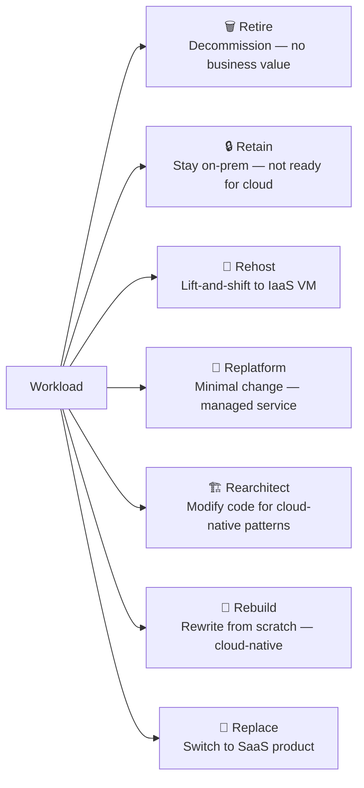
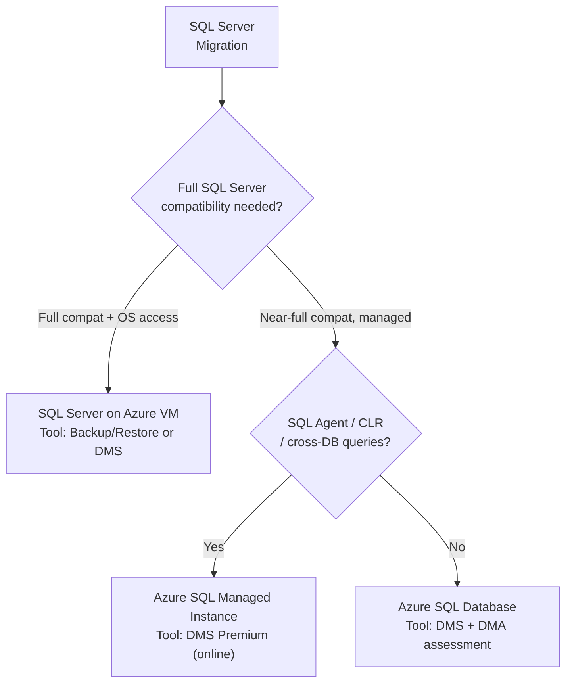

# 🗺️ Migration Strategies
{: .no_toc }

**The 7 Rs, CAF migration phases, Landing Zones, and tool selection by workload**
{: .fs-5 .fw-300 }

---

## Table of Contents
{: .no_toc .text-delta }

1. TOC
{:toc}

---

## The 7 Rs
{: #the-7-rs }

The **7 Rs** (also called migration strategies or "disposition options") are the standardised framework for deciding how each workload should be treated during a migration programme. The AZ-305 exam tests whether you can match a scenario to the correct R.

### Detailed 7 Rs Reference

| Strategy | Also Called | Description | Azure Example | Effort |
|----------|-------------|-------------|---------------|--------|
| **Retire** | Decommission | Shut the workload down — no business value | — | None |
| **Retain** | Revisit | Keep on-premises — compliance, latency, or not yet ready | — | None |
| **Rehost** | Lift-and-shift | Move VM as-is to Azure IaaS — no code or config changes | On-prem VM → Azure VM | Low |
| **Replatform** | Lift-and-reshape | Minor optimisation for a managed service — minimal code change | SQL Server on VM → Azure SQL MI | Low–Medium |
| **Rearchitect** | Refactor | Modify application code to leverage cloud-native capabilities | Monolith → microservices on AKS | High |
| **Rebuild** | Rewrite | Build the application from scratch using cloud-native services | Legacy app → Azure Functions + Cosmos DB | Very High |
| **Replace** | Drop-and-shop | Retire and adopt an equivalent SaaS product | Custom CRM → Dynamics 365 / Salesforce | Medium |

> ⚠️ **Exam Caveat — Rehost vs Replatform:** These two are the most commonly confused.
> - **Rehost**: VM moves to Azure VM — OS, app, config unchanged. Tool: Azure Migrate.
> - **Replatform**: App moves to a managed service (App Service, SQL MI) — app code is unchanged but the runtime or database engine changes slightly. Tool: DMS, App Service Migration Assistant.
> If the scenario says "no code changes, move the VM as-is", the answer is **Rehost**. If it says "move SQL Server to a managed service with minimal changes", the answer is **Replatform**.

---

## Cloud Adoption Framework (CAF)

The **Microsoft Cloud Adoption Framework (CAF)** is the structured methodology for planning and executing cloud migrations. The migration-specific phases are:

| Phase | Activities |
|-------|-----------|
| **1. Strategy** | Define business justification, migration motivations, business outcomes |
| **2. Plan** | Digital estate inventory (Azure Migrate), prioritise workloads, build migration backlog |
| **3. Ready** | Deploy Azure Landing Zone, configure governance, security, networking |
| **4. Migrate** | Migrate waves of workloads using the Assess → Deploy → Release cycle |
| **5. Govern** | Apply Azure Policy, Cost Management, security baseline post-migration |
| **6. Manage** | Operations management, monitoring, patching, backup |

### Migrate Phase — Iterative Cycle

| Step | Activity |
|------|----------|
| **Assess** | Azure Migrate assessment — sizing, cost, compatibility |
| **Deploy** | Replicate + test migration (isolated VNet) |
| **Release** | Cutover, decommission source, update DNS/CMDB |

---

## Azure Landing Zone

An **Azure Landing Zone** is a pre-configured, governed Azure environment that provides the foundation for migrated workloads — networking, security, identity, management, and compliance baselines are all in place before the first workload arrives.

| Component | What It Provides |
|-----------|-----------------|
| **Management Groups** | Hierarchy for applying governance at scale |
| **Subscriptions** | Isolated billing and access control boundaries |
| **Azure Policy** | Enforce governance (tagging, allowed regions, SKU restrictions) |
| **Hub-and-Spoke VNet** | Centralised connectivity, shared services, ExpressRoute / VPN |
| **Azure Firewall / NVA** | Centralised egress control |
| **Log Analytics / Monitor** | Centralised observability |
| **Microsoft Defender for Cloud** | Security posture baseline |

> ⚠️ **Exam Caveat — Landing Zone Before Migration:** The exam expects you to include Landing Zone readiness as a prerequisite step before migrating workloads. If a scenario says "the team wants to start migrating immediately without any Azure preparation", the correct recommendation is to **deploy a Landing Zone first** (even a simplified one).

---

## Migration Tool Selection by Workload

| Workload | Recommended Tool(s) |
|---------|---------------------|
| **VMware VMs → Azure VMs (rehost)** | Azure Migrate: Server Migration (agentless) |
| **Hyper-V VMs → Azure VMs** | Azure Migrate: Server Migration |
| **Physical servers → Azure VMs** | Azure Migrate: Server Migration (agent-based) |
| **VMware VMs → AVS (no format change)** | HCX (vMotion, Bulk, RAV) |
| **SQL Server → Azure SQL DB / MI** | DMS Premium (online) + DMA (assessment) |
| **SQL Server → SQL Server on Azure VM** | Backup/Restore, DMS Offline |
| **Oracle → Azure PostgreSQL** | SSMA for Oracle |
| **MySQL → Azure Database for MySQL** | DMS |
| **IIS web apps → Azure App Service** | App Service Migration Assistant |
| **Generic app → AKS (containerise)** | Azure Migrate (AKS assessment) + manual Dockerfile |
| **SAP on VMware → AVS** | HCX + SAP-specific pre-checks |
| **Large-scale VMware estate (rehost)** | Azure Migrate + agentless replication |

---

## SQL Migration Decision Tree

---

## Cost Optimisation During Migration

| Strategy | Tool / Feature | Saving |
|----------|---------------|--------|
| **Azure Hybrid Benefit** | Bring existing Windows Server / SQL Server licences | Up to 40–55% |
| **Reserved Instances** | 1-year or 3-year commitment for predictable workloads | Up to 60% |
| **Right-sizing** | Performance-based Azure Migrate assessment | 20–40% vs as-on-premises sizing |
| **Dev/Test pricing** | Visual Studio subscribers — discounted VM rates | Significant |
| **Spot VMs** | Non-critical batch/dev workloads | Up to 90% |
| **Azure Advisor** | Post-migration right-size recommendations | Ongoing |

---

## Common Exam Scenarios

| Scenario | Answer |
|----------|--------|
| Move VM to Azure with zero code or config changes | **Rehost** (Azure Migrate: Server Migration) |
| Move SQL Server to Azure with minimal changes, managed service | **Replatform** (Azure SQL MI via DMS) |
| App depends on VMware features, cannot be refactored | **Rehost to AVS** (HCX migration) |
| Custom ERP is being replaced by SAP S/4HANA Cloud | **Replace** (SaaS adoption) |
| Legacy app with no modernisation budget, keep on-prem 2 years | **Retain** |
| Deploy Azure foundation before migrating workloads | **Azure Landing Zone** |
| Reduce cost for predictable post-migration VMs | **Reserved Instances + Azure Hybrid Benefit** |
| Assess which workloads to migrate, retire, or retain | **Azure Migrate** digital estate assessment |

---

[← 05 - Azure VMware Solution](/az-305-bcdr/05-azure-vmware-solution/) | [07 — Feature Comparison →](/az-305-bcdr/07-feature-comparison/) 