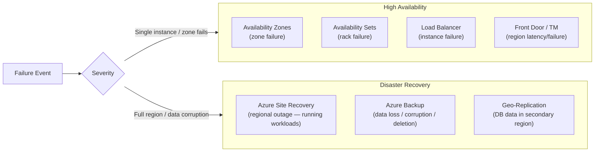

# 📊 Feature Comparison
{: .no_toc }

**Side-by-side reference for HA, BCDR, and migration scenario questions**
{: .fs-5 .fw-300 }

---

## Table of Contents
{: .no_toc .text-delta }

1. TOC
{:toc}

---

## HA vs DR — The Foundational Distinction

| Dimension | HA | DR |
|-----------|----|----|
| **Trigger** | Hardware fault, zone outage | Full regional outage, ransomware, deletion |
| **RTO** | Seconds (auto-failover) | Minutes to hours |
| **RPO** | Near-zero (sync replication) | Seconds to hours |
| **Cost** | Higher (always-on replicas) | Lower (standby / storage) |
| **Manual intervention** | ❌ None | Usually ✅ (trigger failover) |
| **Services** | AZs, Load Balancer, VMSS, SQL AG | ASR, Backup, Geo-replication, Traffic Manager |

---

## Backup vs ASR
{: #backup-vs-asr }

| Decision Factor | Azure Backup | Azure Site Recovery |
|----------------|-------------|---------------------|
| **Primary purpose** | Point-in-time data recovery | Continuous replication for DR failover |
| **Protects against** | Accidental deletion, corruption, ransomware | Regional outage, site failure |
| **RTO** | Hours (restore from vault) | Minutes (replicated VMs pre-staged) |
| **RPO** | Hours (last backup) | Seconds (continuous replication) |
| **Running during DR?** | ❌ (restore to new resource) | ✅ (failed-over VMs are live) |
| **Replication frequency** | Scheduled (daily/hourly/weekly) | Continuous |
| **Data stored** | Recovery Services or Backup Vault | Recovery Services Vault (metadata only) |
| **Soft delete / immutability** | ✅ | ❌ |
| **Cross-region** | ✅ (GRS vault + manual CRR) | ✅ (built-in to ASR) |
| **On-premises support** | ✅ (MARS, MABS) | ✅ (VMware, Hyper-V, Physical) |
| **Cost** | Lower (backup storage) | Higher (compute pre-staged + storage) |

> ⚠️ **Key Rule:** If the scenario says "recover deleted files" or "restore to a point in time" → **Backup**. If it says "keep running in a secondary region during an outage" → **ASR**.

---

## Recovery Objectives Spectrum

| Service / Config | Typical RPO | Typical RTO | Notes |
|-----------------|------------|------------|-------|
| AZs + Zone-redundant SQL | ~0 seconds | ~0 seconds | Synchronous HA — no DR needed |
| SQL Active Geo-Replication | < 5 seconds | < 30 seconds | Async replication, manual failover |
| SQL Auto-Failover Group | < 5 seconds | < 30 seconds | Listener survives failover |
| Azure Site Recovery (Azure-to-Azure VM) | Seconds | Minutes | Replicated disks pre-staged |
| ASR (VMware to Azure) | ~15 seconds | < 2 hours | Process server + mobility service |
| Azure Backup (VM, daily) | Up to 24 hours | Hours | Restore from vault |
| Azure Backup (SQL, log backup 15 min) | 15 minutes | Hours | Transaction log backup |
| Azure Backup (Blob, operational) | Seconds (point-in-time) | Minutes | Continuous protection |
| Cross-Region Restore (manual) | 48 hours data lag | Hours | Manual trigger required |

---

## Load Balancing Selection

| Scenario | Answer |
|----------|--------|
| Distribute HTTP traffic across VMs in one region | **Application Gateway** (L7) |
| Distribute TCP/UDP traffic across VMs in one region | **Azure Load Balancer** (L4) |
| Global HTTP routing + WAF + CDN | **Azure Front Door** |
| Global routing for non-HTTP (TCP, RDP, SMTP) | **Traffic Manager** (DNS-based) |
| Route based on user's country | **Traffic Manager** — Geographic |
| Active/passive DR failover | **Traffic Manager** — Priority |
| Weighted A/B traffic split | **Traffic Manager** — Weighted |
| Internal load balancing inside a VNet | **Internal Load Balancer** |
| SSL offload + URL-based routing + WAF | **Application Gateway** |

---

## Migration Tool Selection Matrix

| Source | Target | Recommended Tool | Migration Type |
|--------|--------|-----------------|----------------|
| VMware VM | Azure VM | Azure Migrate: Server Migration | Rehost |
| VMware VM | AVS | HCX (vMotion / Bulk / RAV) | Rehost |
| Hyper-V VM | Azure VM | Azure Migrate: Server Migration | Rehost |
| Physical server | Azure VM | Azure Migrate (agent-based) | Rehost |
| SQL Server | Azure SQL MI | DMS Premium (online/CDC) | Replatform |
| SQL Server | Azure SQL DB | DMS + DMA assessment | Replatform |
| SQL Server | SQL on Azure VM | Backup/Restore or DMS offline | Rehost |
| Oracle | Azure PostgreSQL | SSMA for Oracle | Replatform |
| MySQL | Azure DB for MySQL | DMS | Replatform |
| IIS web app | Azure App Service | App Service Migration Assistant | Replatform |
| VMware SAP | AVS | HCX + SAP pre-checks | Rehost |

---

## AVS vs Standard VM Migration

| Factor | AVS | Azure VM (Rehost) |
|--------|-----|-------------------|
| VMware tool dependency | ✅ Preserved | ❌ Lost |
| vSphere HA / DRS | ✅ | ❌ |
| VM format change | ❌ (VMDK unchanged) | ✅ (converted to Managed Disk) |
| Migration downtime | Zero (HCX vMotion) | Brief (cutover) |
| Post-migration management | vCenter unchanged | Azure Portal |
| Monthly cost | Higher (bare metal) | Lower (VM pricing) |
| Path to modernisation | Gradual (modernise later) | Immediate |

---

## SLA Comparison

| Service / Configuration | SLA |
|------------------------|-----|
| Single VM (Premium SSD) | 99.9% |
| Two VMs in Availability Set | 99.95% |
| Two VMs across Availability Zones | 99.99% |
| App Service (Standard–Premium) | 99.95% |
| App Service Environment v3 | 99.99% |
| Azure SQL Database (all vCore tiers) | 99.99% |
| Azure SQL + Auto-Failover Group | 99.99% |
| AKS Standard tier | 99.95% |
| AKS + Availability Zones | 99.99% |
| AVS Private Cloud (standard) | 99.9% |
| AVS + vSAN Stretched Clusters | 99.99% |
| Azure Backup (vault) | 99.9% |
| Azure Site Recovery | 99.9% |
| Traffic Manager | 99.99% |
| Azure Front Door | 99.99% |

---

## Vault Type Quick-Reference

| Workload | Vault Type |
|----------|-----------|
| Azure VMs | Recovery Services Vault |
| SQL Server in VM | Recovery Services Vault |
| SAP HANA in VM | Recovery Services Vault |
| Azure Files | Recovery Services Vault |
| On-premises (MARS / MABS) | Recovery Services Vault |
| Azure Blob Storage | **Backup Vault** |
| Azure Managed Disks | **Backup Vault** |
| AKS workloads | **Backup Vault** |
| Azure Database for PostgreSQL | **Backup Vault** |

---

[← 06 — Migration Strategies](/az-305-bcdr/06-migration-strategies/) | [08 — Exam Caveats & Cheatsheet →](/az-305-bcdr/08-exam-caveats-cheatsheet/) 