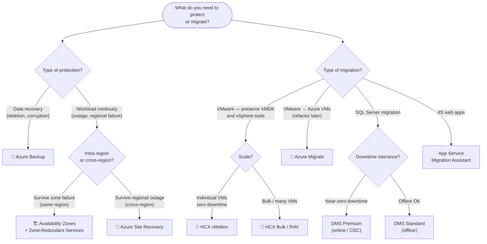

# 🎯 Exam Caveats & Quick-Reference Cheatsheet
{: .no_toc }

**Last-minute review — exam traps, decision trees, and must-memorise numbers**
{: .fs-5 .fw-300 }

---

## Table of Contents
{: .no_toc .text-delta }

1. TOC
{:toc}

---

## ⚠️ The Most Dangerous Exam Traps

### Trap 1 — HA and DR are not the same thing
> ❌ "Deploy VMs across Availability Zones to protect against a full regional outage"
> ✅ AZs protect against **zone failure within a single region** — they do NOT protect against a complete regional outage

For full regional outage protection, combine AZs (HA) with **Azure Site Recovery** or **geo-replication** (DR). AZs alone are insufficient for regional disaster scenarios.

---

### Trap 2 — Azure Backup ≠ Azure Site Recovery
> ❌ "Use Azure Backup to keep VMs running in a secondary region during an outage"
> ✅ Azure Backup restores data **after the fact** from vault — the VM is not pre-staged and not running

Azure Backup = point-in-time recovery (hours RTO). Azure Site Recovery = pre-replicated VMs, near-instant failover (minutes RTO). If the scenario says "minimal downtime during a regional outage", the answer is **ASR**.

---

### Trap 3 — Cross-Region Restore is manual, not automatic
> ❌ "Azure Backup automatically restores VMs to the paired region when the primary region fails"
> ✅ Cross-Region Restore must be **manually triggered** — it does not failover automatically

For automated workload continuation during a regional outage, use **Azure Site Recovery** — not Backup CRR.

---

### Trap 4 — Vault redundancy cannot be changed after first backup
> ❌ "Switch from LRS to GRS after you discover you need cross-region restore"
> ✅ The vault storage redundancy setting is **locked after the first backup item is registered**

If cross-region restore is needed, plan for **GRS** before configuring the first backup. You cannot change the setting retroactively.

---

### Trap 5 — Soft delete default is 14 days, not 180
> ❌ "Soft delete keeps deleted backup data for 180 days by default"
> ✅ The **default soft delete period is 14 days** — enhanced soft delete can be configured up to 180 days

Always-On soft delete (irreversible) and Extended Retention (up to 180 days) must be explicitly enabled. The default is 14 days.

---

### Trap 6 — Locked Immutable Vault is irreversible
> ❌ "Lock the vault as immutable and unlock it next quarter for a retention policy change"
> ✅ A **locked immutable vault cannot be unlocked** — ever. This is intentional for regulatory compliance

Only lock a vault as immutable when permanent WORM compliance is required. Test with an unlocked immutable vault first.

---

### Trap 7 — Recovery Services Vault ≠ Backup Vault
> ❌ "Store Azure Blob backups in a Recovery Services Vault"
> ✅ Azure Blob Storage, Managed Disks, and AKS workloads require a **Backup Vault** — not a Recovery Services Vault

Azure VMs, SQL, SAP HANA, Azure Files, and on-premises workloads use Recovery Services Vault. Everything newer (Blobs, Disks, AKS, PostgreSQL) uses Backup Vault.

---

### Trap 8 — ASR Test Failover does not affect production
> ❌ "Avoid running DR drills because Test Failover will interrupt production VMs"
> ✅ Test Failover starts VMs in an **isolated VNet** — source VMs keep running and replicating

Test Failovers are completely safe for production. The exam expects you to recommend Test Failovers for DR validation exercises.

---

### Trap 9 — ASR app-consistent snapshots are needed for databases
> ❌ "Use crash-consistent snapshots for SQL Server DR with ASR"
> ✅ Crash-consistent snapshots may leave SQL Server in an **inconsistent state** requiring manual recovery

For database workloads, configure **app-consistent snapshots** in the ASR replication policy to ensure clean recovery points.

---

### Trap 10 — AVS requires ExpressRoute — always
> ❌ "Connect an AVS private cloud to Azure VNet using a VPN Gateway"
> ✅ AVS **always requires ExpressRoute** for connectivity to Azure VNets and services — VPN can supplement but not replace

ExpressRoute is mandatory for AVS. The managed AVS ExpressRoute circuit is included at no extra charge.

---

### Trap 11 — On-prem to AVS requires Global Reach
> ❌ "Use a regular VNet gateway to connect on-premises directly to AVS"
> ✅ Direct on-premises ↔ AVS connectivity requires **ExpressRoute Global Reach** (chaining two ExpressRoute circuits)

Without Global Reach, on-prem → AVS traffic must hairpin through an Azure VNet, adding latency and complexity.

---

### Trap 12 — AVS minimum is 3 hosts, SLA without stretched clusters is 99.9%
> ❌ "Deploy 2 AVS hosts for a small proof-of-concept with a 99.99% SLA requirement"
> ✅ AVS requires a **minimum of 3 hosts** (vSAN quorum). Standard SLA is **99.9%** — reach 99.99% only with vSAN stretched clusters

Stretched clusters require at least 3 hosts per site (6 total + 1 witness) and span two Availability Zones.

---

### Trap 13 — HCX vMotion is one VM at a time
> ❌ "Use HCX vMotion to migrate 500 VMs within a 2-week window"
> ✅ HCX vMotion migrates **one VM at a time** with zero downtime — for bulk migration use **HCX Bulk Migration** or **RAV**

HCX Replication Assisted vMotion (RAV) combines bulk parallel replication with zero-downtime final cutover — the best of both approaches at scale.

---

### Trap 14 — Rehost vs Replatform vs Rearchitect
> These three are the most commonly confused Rs:
> - **Rehost** = VM → Azure VM. Zero changes. Tool: Azure Migrate.
> - **Replatform** = App to managed service with minimal changes. No code rewrite. Tool: DMS, App Service Migration Assistant.
> - **Rearchitect** = Code is modified to use cloud-native patterns. Tool: Custom development.

If a scenario says "no code changes, just move to Azure", it is **Rehost** even if the destination is a managed service — unless the runtime or engine itself changes (then it's Replatform).

---

### Trap 15 — Traffic Manager vs Front Door
> ❌ "Use Traffic Manager for a global web application with WAF requirements"
> ✅ Traffic Manager is **DNS-based** — it cannot inspect or modify HTTP traffic, so it cannot provide WAF

For global web apps with WAF, DDoS, SSL offload, and caching → **Azure Front Door**. For non-HTTP global routing (TCP, RDP) or when DNS-only routing is acceptable → **Traffic Manager**.

---

### Trap 16 — DMS Premium for online (near-zero downtime) migration
> ❌ "Use DMS Standard for a 5 TB SQL Server database migration with zero downtime"
> ✅ Online (CDC) migration in DMS requires the **Premium SKU** — Standard only supports offline

If the scenario includes "minimal downtime", "continuous sync", or "near-zero RPO" for SQL migration, the answer is **DMS Premium**.

---

### Trap 17 — Azure Migrate performance-based sizing needs data
> ❌ "Run a performance-based assessment on day 1 of discovery for accurate sizing"
> ✅ Performance-based assessments need **at least 1 day** (recommended 30 days) of utilisation data

For immediate assessments (no history), use **as-on-premises sizing** and right-size post-migration.

---

## 📋 Must-Memorise Numbers

### SLA Table

| Configuration | SLA |
|--------------|-----|
| Single VM (Premium SSD) | **99.9%** |
| Availability Set | **99.95%** |
| Availability Zones | **99.99%** |
| AVS Private Cloud | **99.9%** |
| AVS + Stretched Clusters | **99.99%** |
| Traffic Manager | **99.99%** |
| Azure Front Door | **99.99%** |

### Backup Retention

| Setting | Value |
|---------|-------|
| Soft delete default | **14 days** |
| Enhanced soft delete max | **180 days** |
| Daily backup max retention | **9,999 days (~27 years)** |
| Blob operational backup max | **360 days** |
| LTR maximum | **10 years** |
| GRS cross-region data lag | **~48 hours** |

### ASR Recovery Objectives

| Scenario | RPO | RTO |
|----------|-----|-----|
| Azure VM (Azure-to-Azure) | Seconds | Minutes |
| VMware to Azure | ~15 seconds | < 2 hours |
| Hyper-V to Azure | ~30 seconds | < 2 hours |

### AVS Limits

| Property | Value |
|----------|-------|
| Minimum hosts per private cloud | **3** |
| Maximum hosts per cluster | **16** |
| Maximum clusters per private cloud | **12** |
| Maximum hosts per private cloud | **96** |
| AVS SLA (standard) | **99.9%** |
| AVS SLA (stretched clusters) | **99.99%** |

---

## ⚡ Decision Tree — BCDR and Migration

---

## 🃏 Flash Card — One-Line Definitions

| Service | One-Line Definition |
|---------|-------------------|
| **High Availability** | Eliminates single points of failure — survives component or zone failures automatically |
| **Disaster Recovery** | Restores service after a catastrophic failure — requires separate replication/backup strategy |
| **Azure Backup** | Scheduled or continuous point-in-time protection — vaults, agents, policies, soft delete |
| **Azure Site Recovery** | Continuous replication for DR failover — pre-staged VMs, Recovery Plans, minutes RTO |
| **Azure Migrate** | Unified migration hub — discovery, assessment, server migration, DMS |
| **Azure VMware Solution** | Managed VMware SDDC on Azure bare metal — vSphere, vSAN, NSX-T, HCX unchanged |
| **HCX vMotion** | Live zero-downtime migration of individual running VMs between vSphere environments |
| **7 Rs** | Retire, Retain, Rehost, Replatform, Rearchitect, Rebuild, Replace — migration disposition options |
| **Landing Zone** | Pre-configured Azure environment — governance, networking, security before first workload |
| **DMS Premium** | Azure Database Migration Service — online CDC migration for near-zero downtime SQL moves |

---

## 🔑 Feature Lock-In Summary

| If the exam says… | The answer is… |
|------------------|---------------|
| Survive a zone failure with zero downtime | **Availability Zones** |
| Survive a complete regional outage | **Azure Site Recovery** (+ AZs for HA within region) |
| Recover deleted backup data within 14 days | **Soft Delete** (default) |
| WORM compliance, irreversible backup protection | **Locked Immutable Vault** |
| Cross-region restore from Backup | **GRS vault** + manual CRR |
| Azure Blob / Managed Disk backup | **Backup Vault** |
| Azure VM / SQL / SAP HANA backup | **Recovery Services Vault** |
| Protect on-prem files/folders | **MARS Agent** → Recovery Services Vault |
| Protect on-prem VMware workloads (backup) | **MABS** → Recovery Services Vault |
| Replicate on-prem VMware to Azure (DR) | **ASR** + Configuration Server + Mobility Service |
| Test DR without impacting production | **ASR Test Failover** (isolated VNet) |
| Multi-tier app failover in correct order | **ASR Recovery Plan** with ordered groups |
| Migrate VMware without changing VM format | **AVS** + HCX |
| Connect AVS to Azure | **ExpressRoute** (mandatory) |
| Connect on-prem directly to AVS | **ExpressRoute Global Reach** |
| Zero-downtime live migration of a single VM | **HCX vMotion** |
| Migrate 500 VMs quickly with brief cutover | **HCX Bulk Migration** or **RAV** |
| AVS 99.99% SLA | **vSAN Stretched Clusters** |
| Global web routing with WAF | **Azure Front Door** |
| Global non-HTTP routing / active-passive DR | **Traffic Manager** |
| Online SQL migration, near-zero downtime | **DMS Premium** |
| Migrate VMs as-is with no changes | **Rehost** via Azure Migrate |
| Move SQL Server to managed service, minimal change | **Replatform** via DMS |

---

## ✅ Final Exam Checklist

Before sitting the exam, verify you can answer these without hesitation:

- [ ] What is the difference between HA and DR — which Azure services serve each?
- [ ] What SLA does a single VM get without AZ? With Availability Set? With AZs?
- [ ] What is the difference between Recovery Services Vault and Backup Vault?
- [ ] Which workloads go in which vault type?
- [ ] What is the default soft delete period? What is the maximum?
- [ ] What happens when you lock an immutable vault?
- [ ] What vault redundancy is required for Cross-Region Restore?
- [ ] What is the difference between Test Failover, Planned Failover, and Unplanned Failover in ASR?
- [ ] When do you need app-consistent snapshots vs crash-consistent?
- [ ] What is an ASR Recovery Plan and when is it needed?
- [ ] What connectivity is mandatory for AVS?
- [ ] What is the minimum number of hosts in an AVS private cloud?
- [ ] What is the difference between HCX vMotion, Bulk Migration, and RAV?
- [ ] When does AVS achieve 99.99% SLA?
- [ ] What are the 7 Rs — and which tool maps to Rehost vs Replatform?
- [ ] What does DMS Premium provide that Standard does not?
- [ ] When should you use Traffic Manager vs Azure Front Door?
- [ ] What is an Azure Landing Zone and when should it be deployed?

---

[← 07 — Feature Comparison](/az-305-bcdr/07-feature-comparison/) | [Back to Home →](/az-305-bcdr/) 